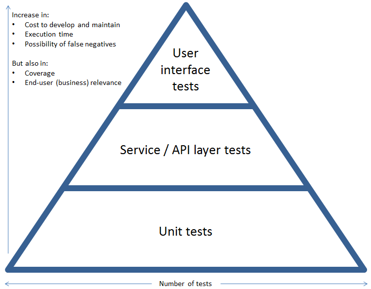

# Testing APIs

## Jest

* Test runner = existe in all tests of your projects pass and show your resolte.

* Test fixtures = set configuration and organize by modules, your test is executed in your own enviroment

* Assertions

* Moking

> https://jestjs.io/docs/getting-started

### Server Install

> npm install jest --save-dev

### File Name

> *.test/spec.js

## Supertest

### Server Install

HTTP assertions made easy via superagent. Maintained for Forward Email and Lad.

The motivation with this module is to provide a high-level abstraction for testing HTTP, while still allowing you to drop down to the lower-level API provided by superagent.

> npm install supertest --save-dev