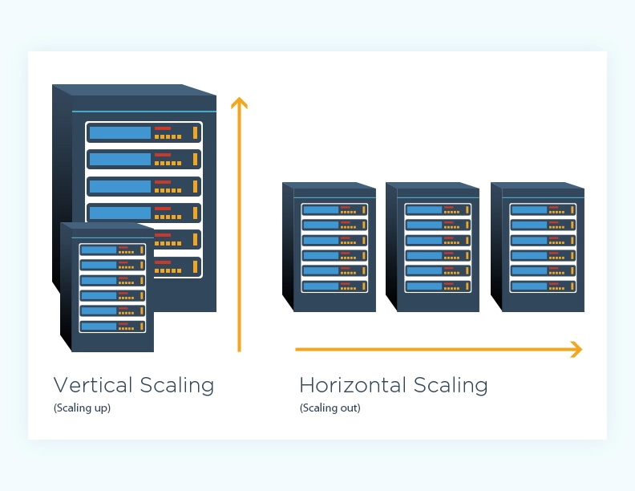
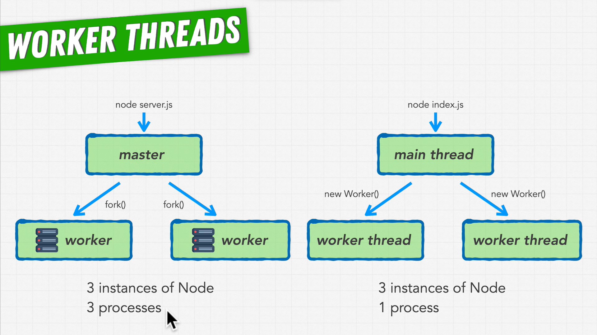

# Improving Node Performance

## cluster.schedulingPolicy

Added in: v0.11.2
The scheduling policy, either cluster.SCHED_RR for round-robin or cluster.SCHED_NONE to leave it to the operating system. This is a global setting and effectively frozen once either the first worker is spawned, or .setupPrimary() is called, whichever comes first.

SCHED_RR is the default on all operating systems except Windows. Windows will change to SCHED_RR once libuv is able to effectively distribute IOCP handles without incurring a large performance hit.

cluster.schedulingPolicy can also be set through the NODE_CLUSTER_SCHED_POLICY environment variable. Valid values are 'rr' and 'none'.

> cluster.schedulingPolicy = cluster.SCHED_RR;

## os.cpus()

Added in: v0.3.3

Returns: <Object[]>

Returns an array of objects containing information about each logical CPU core. The array will be empty if no CPU information is available, such as if the /proc file system is unavailable.

> os.cpus().length;

## Crypto

> crypto.pbkdf2(password, salt, iterations, keylen, digest, callback)

Scrypt is a password-based key derivation function (hash password).

> crypto.scrypt(password, salt, keylen[, options], callback)

### Hash Function

Hash functions can be used for many different problems, from integrity and authenticity (see Chapter 6, “Message Authentication Code Algorithms”) to pseudo random number generation (see Chapter 3, “Random Number Generation”) and key derivation. Now we shall explore the latter property.

Key derivation functions (KDF) derive key material from another source of entropy while preserving the entropy of the input and being one-way. Key derivation is often used for more than generating key material. It is also used to derive initial values (IV) and nonces (see Chapter 6) for cryptographic sessions.

## Load Balancing

Distributing a set of tasks to a set of resources. For example, dividing which resources will be handled by which processes, if you have a cluster of worker processes for your server.

> https://en.wikipedia.org/wiki/Load_balancing_(computing)

### Horizontal Scaling and Vertical Scaling



### PM2

PM2 is a production process manager for Node.js applications with a built-in load balancer. It allows you to keep applications alive forever, to reload them without downtime and to facilitate common system admin tasks.

* monitoring

* log

* whatch and restart

Command: `pm2 start *.js`, `pm2 status`, `pm2 stop id/name`, `pm2 delete name`, `pm2 logs`, `pm2 restart server`, `pm2 logs --lines 200`, `pm2 start *.js -l(logs) logs.txt -i(instance) max`, `pm2 show 0`, `pm2 monit`, `pm2 reload server` 

## Worker threads

Worker threads is completely link with browser(v8), diferente the clusters with use processor of cpu.

> https://nodejs.org/api/worker_threads.html

The node:worker_threads module enables the use of threads that execute JavaScript in parallel. To access it:

```js
const worker = require('node:worker_threads');
```

Workers (threads) are useful for performing CPU-intensive JavaScript operations. They do not help much with I/O-intensive work. The Node.js built-in asynchronous I/O operations are more efficient than Workers can be.

Unlike child_process or cluster, worker_threads can share memory. They do so by transferring ArrayBuffer instances or sharing SharedArrayBuffer instances.

