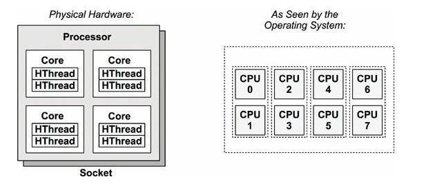

# Understanding Physical and Logical CPUs

Here is a quick write up on what actually Physical and Logical CPU mean, and how are they different.

To begin with, the term "CPU" is very vaguely and loosely used with reference Processors, Cores or hardware threads all over the internet. But generally Cores are more accurate correspondents of CPU.

Lets first look at a few terms:

Processor : is a physical chip that plugs in to socket of the system and it contains one or more CPUs which are implemented as Cores or Hardware threads.

Core : is an independent CPU instance on a multicore-processor. The use of cores in a way to scale the processor is called chip-level multi-processing.

Hardware Thread : in a CPU architecture that supports executing multiple threads simultaneously on each core, every thread is run as an independent CPU instance. This scaling approach is known as multithreading.

Now that we know the required terms, a Physical CPU means the actual Physical Core that is present on a processor. The multithreading being enabled on the core or not doesn't impact the count of Physical CPUs present on a Processor. In short, Physical CPU correlates to the actual Physical Cores present on a processor. In the above diagram there are 4 Physical Cores present on the Single Processor.

Logical CPU intern refers to the ability of each core doing 2 or more tasks simultaneously. This is achieved by enabling hyperthreading on the cores. Each single physical core can be divided in to multiple logical core by enabling hyperthreading on them. In the above diagram, although there are only 4 Physical cores, the system is tricked to look at it as 8 Logical CPUs, by enabling hyperthreading on each core.

The above diagram correlates to below details :

1 Processor, 4 Physical cores, 8 Logical Cores. In other words - 1P4C - with 2 threads per core.

You can check these details on your system using the command : lscpu

Here is the relevant information that I would take from above output [1P2C - with 2 threads per core, and 4 Logical CPUs]

CPU socket(s): 1 --> 1 Processor

Core(s) per socket: 2 --> 2 Cores (2 in total)

Thread(s) per core: 2 --> 2 Threaded

CPU(s): 4 --> 4 Logical CPUs in total

4 Logical CPUs is arrived by -- > 2 Cores X 2 Threaded

Just another different example to make things clear, and close this article :

Here is the above output : [2P8C - with 2 threads per core, 16 Logical CPUs]

Sockets : 2 --> 2 processors

Cores per socket : 4 --> 4 Cores per processor (2X4=8Total cores)

Threads per core : 2 --> 2 Threaded

CPUs : 16 -- > 16 Logical CPUs

16 Logical CPUs is arrived by -- > 2 Processors X 4 Cores/processor X 2 Threads/core

Hope this helps.

[Edit]:

Just to add, there is a term called "OCPUs" used in Oracle world. Simply put OCPU’s are "Oracle CPU’s." As mentioned in Oracle Documentation :

"An OCPU provides CPU capacity equivalent of one physical core of an Intel Xeon processor with hyper threading enabled. Each OCPU corresponds to two hardware execution threads, known as vCPUs."

So 2OCPU is equivalent to 4 Logical [virtual] CPUs.