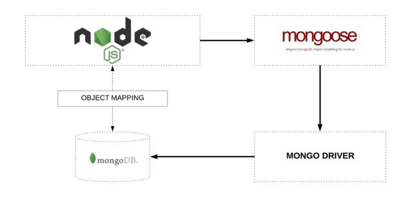
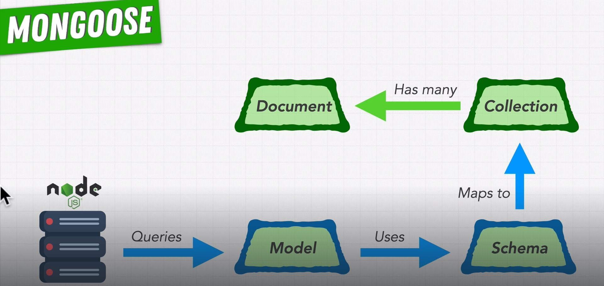

# DATABASE

|                | MongoDB            | Postgres         |
|:--------------:|--------------------|------------------|
| Type           | Document           | Relacional       |
| Organized into | Collection         | Tables           |
| Query Language | noSQL              | SQL              |
| Scaling        | Primary Horizontal | Primary Vertical |
| Schema         | Flexible           | Rigid            |

## MongoDB

Validation data

dw9wPWyJLAQh9XAo

## PostgreSQL

## Object–relational impedance mismatch

> https://en.wikipedia.org/wiki/Object%E2%80%93relational_impedance_mismatch

## ACID

> https://www.ibm.com/docs/en/cics-ts/5.4?topic=processing-acid-properties-transactions

## Connectio with database

CIDR = 0.0.0.0/0

> mongodb+srv://brufesdias:<password>@cluster-nasa-project.zo4guy3.mongodb.net/?retryWrites=true&w=majority

## Object Relational Mapping (ORM) vs Object Document Mapping (ODM)

> https://medium.com/spidernitt/orm-and-odm-a-brief-introduction-369046ec57eb

Object modeling

## Knex vs Sequelize (SQL)

> https://stackshare.io/stackups/knex-js-vs-sequelize#:~:text=In%20summary%2C%20Knex.,associations%2C%20migrations%2C%20and%20validations.

In summary, Knex.js is a more flexible and query-focused SQL query builder, while Sequelize is a comprehensive ORM that provides features like model associations, migrations, and validations. Knex.js allows developers more control and flexibility over SQL queries, while Sequelize simplifies the interaction with the database by providing higher-level abstractions. For complex projects requiring advanced database management features, Sequelize is more suitable, whereas Knex.js may be a better choice for projects that prioritize control and flexibility over simplicity.

## Mongoose (noSQL)

