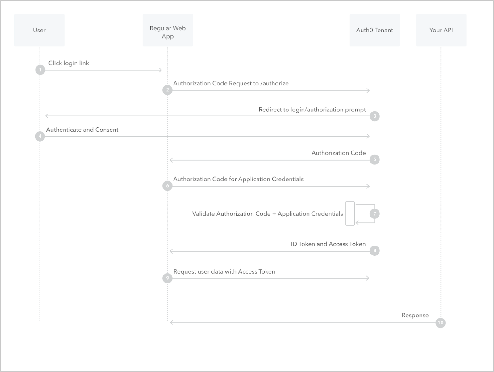
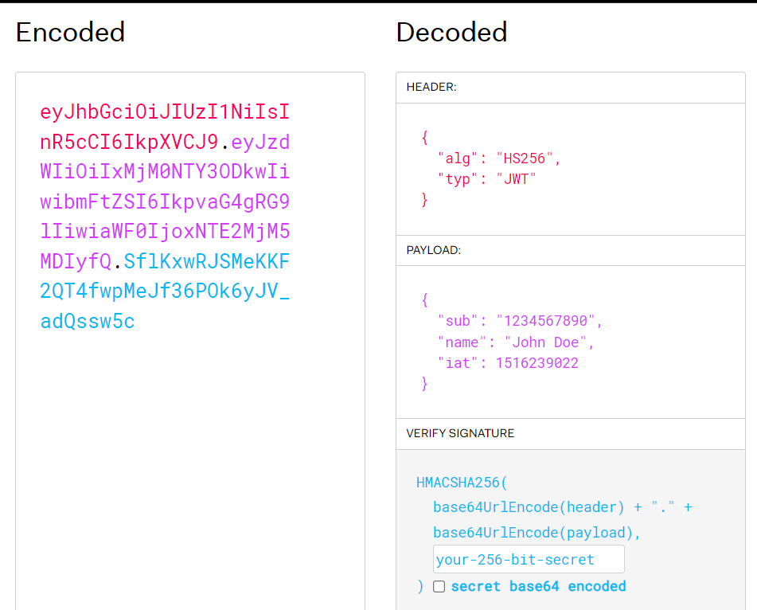

# Security + Authentication

## Encrypted Connections with SSL and TLS

TLS is the successor to SSL.

TLS encrypts your traffic.

### HTTPS vs HTTP


### Digital Certificate

Used to verifify server's ownership prior to sending encrypt data.

### Certificate Authority

A trusted organization that issues digital certificates

### Self-Signed Certificate

Enable HTTPS but not trusted by others. Useful for development.

### CA-Signed Certificate

Trusted by most clients on the web. Useful for production.

### Contenty Delivey Netword (CDN)

Amazon CloudFront and Google Cloud CDN.

### Command create new key SSL crypto

`openssl req -x509 -newkey rsa:4096 -nodes -keyout key.pem -out cert.pem -days 365`

.pem is real certificate extension.

-keyout (key private)

-out (certificate)

### Create Server Https

```js
https.createServer({
    key: fs.readFileSync('key.pem'), // synchrounos block-function
    cert: fs.readFileSync('cert.pem') // synchrounos block-function
}, app).listen(PORT, () => {
    console.log(`http://localhost:${PORT}`);
})
```

### Helmet.js

> https://helmetjs.github.io/

```js
import express from "express";
import helmet from "helmet";

const app = express();

// Use Helmet!
app.use(helmet());

app.get("/", (req, res) => {
  res.send("Hello world!");
});

app.listen(8000);
```

By default, Helmet sets the following headers:

* Content-Security-Policy: A powerful allow-list of what can happen on your page which mitigates many attacks

* Cross-Origin-Opener-Policy: Helps process-isolate your page

* Cross-Origin-Resource-Policy: Blocks others from loading your resources cross-origin

* Origin-Agent-Cluster: Changes process isolation to be origin-based

* Referrer-Policy: Controls the Referer header
Strict-Transport-Security: Tells browsers to prefer HTTPS

* X-Content-Type-Options: Avoids MIME sniffing

* X-DNS-Prefetch-Control: Controls DNS prefetching

* X-Download-Options: Forces downloads to be saved (Internet Explorer only)

* X-Frame-Options: Legacy header that mitigates clickjacking attacks

* X-Permitted-Cross-Domain-Policies: Controls cross-domain behavior for Adobe products, like Acrobat

* X-Powered-By: Info about the web server. Removed because it could be used in simple attacks

* X-XSS-Protection: Legacy header that tries to mitigate XSS attacks, but makes things worse, so Helmet disables it

## Authorization vs Authentication

### Authorization


### Authentication


## Social sign-in

Examples: Google, Facebook and Instagram

## API Keys

> https://cloud.google.com/endpoints/docs/openapi/when-why-api-key

API keys provide

Project identification — Identify the application or the project that's making a call to this API

Project authorization — Check whether the calling application has been granted access to call the API and has enabled the API in their project

### OAuth 2.0



### JWT (JSON Web Tokens)

Authorization: Bearer (JWT)

Base64 enconding

JWT divided into three parts: Header, payload and signature



### Control API requests

Status Code = 429 Too Many Requests

Protect your API the millions requests per hour, limit the requests for the server is doesn't breaking.

Api controls have different permission for different keys and this is important for your usuares.

## Sessions, Tokens and Cookies

### Sessions

Temporary and the user not change, sessions like database but your life is short, if you logout in your applocation the sessions is free.

Two packages `express-session` and `cookie-sesion`

> https://www.npmjs.com/package/express-session

> https://www.npmjs.com/package/cookie-session

* Cookie-session side client settings

### Tokens


### Cookies

Cockies are almost always used to implement the session.

* State cookies
* Stateless cookies

> Server VS Client Side Sessions With Cookies => see again

> Session Middleware in Express => see again

## 