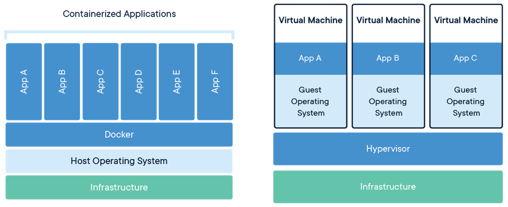

# Production and the Cloud (Docker + AWS)

## Serverless Architecture with AWS Lambda

### Pontos positivos

### Contra

Seu código pode sofrer de maior latência, em termos de respostas mais altas, do que código baseado em servidor se você não tiver cuidado sobre como você configura sua arquitetura sem servidor.

## Containers vs Virtual Machine

> https://tech.forums.softwareag.com/t/what-can-you-do-with-containers/256697

## Docker

> docker run -p 80:80 docker/getting-started

Open `http://localhost:80`

> docker login

Login in Docker Hub

> docker build . -t jhonatasdias/nasa-project

Inicialize dockerfile with flag -t (name the container)

> docker run -it (within terminal image nasa-project) -p 8000:8000 jhonatasdias/nasa-project

# Problem

The command in dockerfile `npm run build --prefix client` doesnt work.