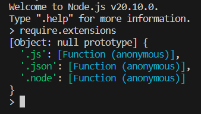

# Module System

## The require Function

`const ModuleName = require('stringModuleName')`

> With Node REPL (Read-Eval-Print-Loop)

## Module

Core modules from Node.js

| Module          | Description                                                |
|-----------------|------------------------------------------------------------|
| assert          | Provides a set of assertion tests                           |
| buffer          | To handle binary data                                       |
| child_process   | To run a child process                                      |
| cluster         | To split a single Node process into multiple processes     |
| crypto          | To handle OpenSSL cryptographic functions                   |
| dgram           | Provides implementation of UDP datagram sockets            |
| dns             | To do DNS lookups and name resolution functions             |
| domain          | Deprecated. To handle unhandled errors                      |
| events          | To handle events                                           |
| fs              | To handle the file system                                   |
| http            | To make Node.js act as an HTTP server                        |
| https           | To make Node.js act as an HTTPS server                       |
| net             | To create servers and clients                               |
| os              | Provides information about the operation system             |
| path            | To handle file paths                                        |
| punycode        | Deprecated. A character encoding scheme                     |
| querystring     | To handle URL query strings                                  |
| readline        | To handle readable streams one line at a time               |
| stream          | To handle streaming data                                    |
| string_decoder  | To decode buffer objects into strings                       |
| timers          | To execute a function after a given number of milliseconds  |
| tls             | To implement TLS and SSL protocols                           |
| tty             | Provides classes used by a text terminal                     |
| url             | To parse URL strings                                        |
| util            | To access utility functions                                 |
| v8              | To access information about V8 (the JavaScript engine)      |
| vm              | To compile JavaScript code in a virtual machine              |
| zlib            | To compress or decompress files                              |

## Creating Our Own Modules

### TLS

## CommonJS vs ECMAScript Modules

### Import/export vs require()/module.exports

## Importing Core Modules

Importing core Modules Node.js

`const http = require('node:http')`

## Should We User index.js?

> https://www.youtube.com/watch?v=M3BM9TB-8yA

